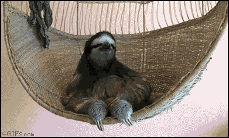

 # Strange Animal Trivia Game

Want to test your knowledge about animals? Check out the game here. [Animal Trivia](https://meganthonykeogh.github.io/Strange-Animal-Facts-Trivia-Game/)

During this project, I learned how to use time intervals in JavaScript in the form of a trivia game. 

This project is still in it's first few iterations. I would like to add more modals and a few different screens depending on how well the user did during the trivia game. 

There are not npm packages or devdependencies to test this game. 

